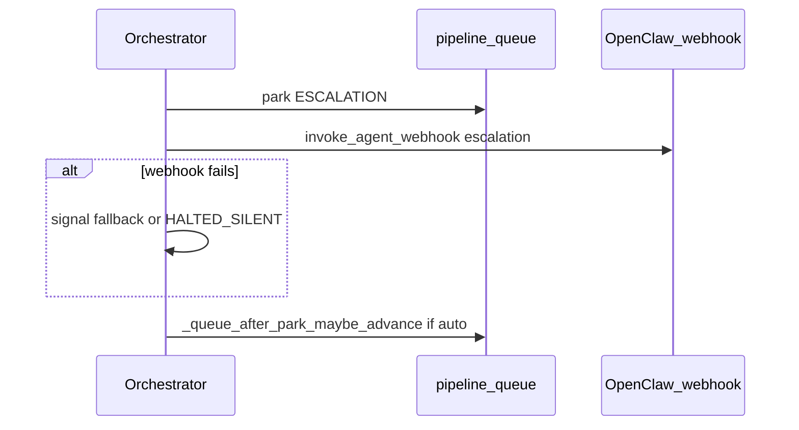

# Queue closure — post-implementation E2E validation

This pass validates **everything shipped in the queue / escalation / dependency / preflight / observability closure** (orchestrator + server + queue UI), not only S1–S3. It follows the same strict rules as [05-STRICT-E2E-RUNBOOK.md](plans/Active/queue-e2e-manual-validation/05-STRICT-E2E-RUNBOOK.md).

---

## Mandatory operating standards (non-negotiable)

| ID | Rule |

|----|------|

| **R1** | **Spec order:** [TASK-03-PROJECT-QUEUE.md](plans/Active/TASK-03-PROJECT-QUEUE.md) (Implementation notes at EOF) → [00-source-of-truth.md](plans/Active/queue-e2e-manual-validation/00-source-of-truth.md) → live code [autodev/pipeline/orchestrator.py](autodev/pipeline/orchestrator.py), [ui/server.py](ui/server.py), [ui/index.html](ui/index.html). Cite this order in the report **Summary**. |

| **R2** | **No product code edits** during the validation run (observe only; file tickets for gaps). **Runtime data** (`pipeline_queue.json`, `pipeline_state.json`, symlink) may change **only** to force scenarios, with **backups first**. |

| **R3** | **Primary evidence = UI + integrated behavior.** Browser: navigate → snapshot → action → **wait** → snapshot. **pytest** is **appendix-only**; it **never** replaces UI/API proof for a claimed **Pass**. |

| **R4** | **Wait discipline:** `browser_wait_for`, or shell loops with **2–10s** sleeps between probes, or documented **max wall-clock per checkpoint**. Slowness is not a reason to skip. |

| **R5** | **Forbidden shortcuts:** No **Pass** without **browser snapshot excerpt** or **screenshot** for user-visible behavior; no **Pass** on pytest alone; no **N/A** to mean “did not try”; **Skipped** only per **R6**. |

| **R6** | **Skipped** only for: **unsafe** (e.g. real production Signal), **impossible** (missing hardware), or **operator-blocked** before the run. **Impatience / session length / convenience are not allowed.** Each **Skipped** row states **unsafe \| impossible \| operator** and **one sentence** of fact. |

| **R7** | **N/A ban (strict):** Gate/scenario tables use **N/A** **only** when structurally out of scope for this product version (**prove** with TASK-03 quote). Otherwise **Pass** or **Fail**. If unreachable after **documented forcing**, default **Fail**, not N/A. See [01-logic-gate-edge-cases.md](plans/Active/queue-e2e-manual-validation/01-logic-gate-edge-cases.md). |

| **R8** | **Test paths:** `/home/pi/projects/queue-test1` … `queue-test5-esc` per 00-source-of-truth unless operator overrides **in writing**. Clean/stage queue matrix in Phase A. |

| **R9** | **Accountability:** Every **Pass**: **(a)** UI quote, **(b)** `curl`/`jq` when an API contract exists, **(c)** timestamp or step id. Every **Fail**: what was tried, waits, what was observed. |

---

## Deliverable (supplemental report + TLDR)

Write **one** markdown file under [plans/Active/queue-e2e-manual-validation/](plans/Active/queue-e2e-manual-validation/) with a **dated** filename (e.g. `QUEUE-E2E-VALIDATION-REPORT-QUEUE-CLOSURE-YYYY-MM-DD.md`).

**Required sections:** Summary (R1 order cited), **V1–V5** and **S1–S3** scenario tables (Pass/Fail/Skipped with R9 evidence), gates touched (reference [01-logic-gate-edge-cases.md](plans/Active/queue-e2e-manual-validation/01-logic-gate-edge-cases.md) as needed), misalignments vs TASK-03, risks, recommended tickets, environment, wait budget, forcing log.

**Final review — TLDR (mandatory):** The **Final review** section must **start or end** with a **TLDR** block: **3–8 bullets** covering (1) what scope was validated, (2) overall pass/fail headline, (3) top risks or follow-ups, (4) any tickets filed. This is for skimmers; the tables remain the source of truth.

---

## Phase A — Preconditions (lock-in)

- Record UI base URL (e.g. `http://localhost:18790`).
- `curl -sS http://localhost:18790/api/state` → **200**.
- Resolve `pipeline_queue_path`, `pipeline_state_path`, symlink path from env + [ui/config.json](ui/config.json) + `load_config()` (do not assume defaults if overridden).
- **Backup:** `cp pipeline_queue.json pipeline_queue.json.bak.<stamp>` and same for `pipeline_state.json` (use resolved paths).
- **Stage** canonical queue (R8): positions contiguous; set `queue_mode` per upcoming scenario; document matrix in forcing log.
- After each advance: `readlink -f` on configured `pipeline-project` symlink.
- Read docs: TASK-03 + EOF → `00-source-of-truth` → `01` (gates) → this plan → code.

---

## V1 — Startup `PIPELINE_COMPLETE` + queue auto-advance

**Goal:** When the orchestrator **starts** and `phase_resolver` reports **roadmap already complete** for the active project, the queue row becomes **`COMPLETED`** and, with **`queue_mode: auto`**, the **next eligible** project becomes **`ACTIVE`** (same intent as main-loop completion), **without** relying on the main planner loop to hit `PIPELINE_COMPLETE` first.

**Steps (browser-first where applicable):**

1. Prepare **queue-test1** (or equivalent R8 repo) so `phase_resolver` returns **`PIPELINE_COMPLETE`** at process start (all phases done on disk); queue has **two** entries: first **ACTIVE** matching symlink, second **READY**.
2. `PATCH` **`queue_mode: auto`**; confirm via UI + `GET /api/queue`.
3. Launch orchestrator (normal operator flow).
4. **Poll** (R4): `GET /api/queue`, `readlink`, `GET /api/state` every 2–10s until pass criteria or documented timeout.

**Pass criteria:** First row **`COMPLETED`**; second row **`ACTIVE`**; `pipeline_state.json` `project_path` realpath matches symlink for second project; orchestrator did **not** exit leaving first row non-`COMPLETED` while a **READY** next exists.

**Code if V1 fails:**

| Symptom | Location | What to verify |

|--------|----------|----------------|

| No advance after startup complete | [orchestrator.py](autodev/pipeline/orchestrator.py) `_run_startup_planner_phase_zero_and_branch` — branch on `PIPELINE_COMPLETE` (~1515–1527) | After `_queue_update_active_entry("COMPLETED", ...)`, `queue_mode == "auto"` must call `_select_next_queue_project()`; **`retry_startup`** must re-enter startup block for new symlink. |

| Startup loop exhaustion | Same file `run()` startup `while` (~1639–1651) | Max iterations guard; logs for “exceeded max iterations”. |

| COMPLETED not written | `_find_active_queue_entry` (~279–306) | **ACTIVE** row must match symlink / `state["project_path"]` realpath. |

---

## V2 — Escalation webhook before auto-advance + parked-path polling

**Goal:** On main-loop **escalation** path: **`_queue_park_active_entry("ESCALATION", ...)`** then **`invoke_agent_webhook("escalation", ...)`** **before** **`_queue_after_park_maybe_advance()`** (~2463–2490). Under **auto**, symlink may move to next project; human/Signal replies must still be observable via polling **`escalation_output.done`** under **symlink target** and under **ESCALATION** rows’ **`project_path`**.

**Steps:**

1. Stage **auto**; queue e.g. **`queue-test5-esc`** then **`queue-test2`** (both eligible, no blocking deps).
2. Run pipeline until **`WAITING_FOR_HUMAN`** and queue shows **`ESCALATION`** (live agents — **R6** if unsafe to use real OpenClaw/Signal).
3. Capture **ordered evidence**: orchestrator logs or gateway logs showing **webhook** after park; then `readlink` / `GET /api/queue` showing advance **if** auto.
4. If safe: place or simulate **`escalation_output.json`** + **`.done`** under **parked** project directory (not only under new symlink) and confirm orchestrator/UI picks up command per design.

**Code if V2 fails:**

| Symptom | Location | What to verify |

|--------|----------|----------------|

| Advance before webhook | [orchestrator.py](autodev/pipeline/orchestrator.py) ~2462–2490 | Order must be park → webhook (and failure `break`) → `_queue_after_park_maybe_advance()`. |

| Wrong dir for escalation files | `_escalation_poll_roots`, `_poll_escalation_output_json_path` (~488+) | Roots include symlink realpath **and** **ESCALATION** queue row **`project_path`** roots. |

---

## V3 — Dependency semantics + UI (DEP / hold / promotion)

**Goal:** Shared rules in [queue_semantics.py](autodev/pipeline/queue_semantics.py): **`DEPENDENCY_HOLD`** only when parent is **`BLOCKED`** or **`ESCALATION`**; child stays **`READY`** while parent is **`ACTIVE`** / **`READY`** / **`SKIPPED_PENDING`** (but still cannot **start** until parent **`COMPLETED`**). On parent **`COMPLETED`**, children on **`DEPENDENCY_HOLD`** promote to **`READY`**. UI: **DEP** badge tooltips distinguish “dependent (waits for parent complete)” vs “on hold (blocked parent)”; header summary includes **on hold (blocked parent)** and **dependent** count where applicable.

**Steps:**

1. Use API + UI: add/patch parent relationships per matrix (see TASK-03 EOF).
2. `GET /api/queue` after each change; snapshots for Queue list + detail panel tooltips.
3. Orchestrator or API-driven transitions: parent **ACTIVE** + child **READY** → child remains **READY** (not **DEPENDENCY_HOLD**); parent **BLOCKED** → child **DEPENDENCY_HOLD**; parent **COMPLETED** → promoted child **READY**.

**Code if V3 fails:**

| Symptom | Location | What to verify |

|--------|----------|----------------|

| Wrong hold semantics | [queue_semantics.py](autodev/pipeline/queue_semantics.py) `parent_blocks_child` | Only **BLOCKED** / **ESCALATION** block. |

| Orchestrator demotes wrongly | [orchestrator.py](autodev/pipeline/orchestrator.py) `_select_next_queue_project` (~356–364) | Skip until parent **COMPLETED**; set **DEPENDENCY_HOLD** only if `parent_blocks_child`. |

| No promotion | `_queue_promote_children_after_parent_completed`, `_queue_update_active_entry` (~427–456) | On **COMPLETED**, children in **DEPENDENCY_HOLD** → **READY**. |

| API add/patch wrong | [ui/server.py](ui/server.py) `post_queue_add`, `patch_queue_parent` | Uses `parent_blocks_child` for initial/patched **DEPENDENCY_HOLD**. |

| UI copy wrong | [index.html](ui/index.html) `depBadgeTitle`, summary line | Tooltip + counts match semantics. |

---

## V4 — Preflight: phase-only branch (no main/master)

**Goal:** Git repo with **at least one commit** on **`phase/...`** (or detached **HEAD**) but **no** **`main`**/**`master`** branch name → `_run_preflight_checks` **git repo** check is **warn** (or pass+warn message), **not** **fail**, with message referencing phase branches / integration.

**Steps:**

1. Create or use R8-compatible clone with commit on **`phase/foo`** only (no main/master), plus required roadmap/workspace assumptions for your test harness.
2. Run **Preflight** from UI or code path that calls `_run_preflight_checks`.
3. Confirm check list: no **fail** solely for missing main/master; **warn** text present.

**Code if V4 fails:**

| Symptom | Location | What to verify |

|--------|----------|----------------|

| Incorrect fail | [ui/server.py](ui/server.py) `_run_preflight_checks` git block (~4178–4220) | **`git rev-parse --verify HEAD`** success → **warn** branch; else fall through to unborn/fail paths. |

---

## V5 — `GET /api/state` exposes `queue_halted_reason`

**Goal:** When `pipeline_state.json` contains **`queue_halted_reason`** (e.g. orchestrator set **`QUEUE_HALTED`**), **`GET /api/state`** returns that field for the Pipeline Monitor / debug alignment.

**Steps:**

1. Force or wait for **`QUEUE_HALTED`** with a known **`queue_halted_reason`** (or edit **runtime** state JSON from backup — document).
2. `curl` `/api/state` | `jq` — assert key present and matches disk.

**Code if V5 fails:**

| Symptom | Location | What to verify |

|--------|----------|----------------|

| Field missing | [ui/server.py](ui/server.py) `get_state` response (~1404–1423) | `queue_halted_reason` from pipeline state; **null** when absent. |

---

## S1 — Auto progression regression (main loop) (G2)

**Goal:** First project reaches **`PIPELINE_COMPLETE`** in the **main loop** → next **READY** becomes **ACTIVE** when **`queue_mode: auto`** (baseline regression).

**Pass criteria:** Same as historical S1: first **COMPLETED**, second **ACTIVE**; symlink matches.

**Code if S1 fails:**

| Symptom | Location | What to verify |

|--------|----------|----------------|

| No advance after main-loop complete | [orchestrator.py](autodev/pipeline/orchestrator.py) main planner path ~2216–2240 | After `_queue_update_active_entry("COMPLETED")`, auto → `_select_next_queue_project()` then **`continue`**. |

---

## S2 — Manual + Trigger next regression (G3–G4)

**Goal:** **`manual`**: second project does not start until **Trigger next**; **409** only when some row **ACTIVE**.

**Code if S2 fails:** [ui/server.py](ui/server.py) `post_queue_trigger_next` — **ACTIVE** guard; preflight skip path ~4363+.

---

## S3 — Park-and-advance regression (G5)

**Goal:** **`WAITING_FOR_HUMAN`** → row **ESCALATION** + **`parked_*`**; **auto** advances symlink to next eligible; **manual** does not.

**Code if S3 fails:** `_queue_park_active_entry`, `_queue_after_park_maybe_advance` (~460–486); contrast **repo-init** path (no auto-advance per TASK-03).

---

## Optional appendix (after primary evidence)

```bash
cd /path/to/autodev-ui && source .env
PYTHONPATH=. pytest tests/test_queue_api.py tests/test_queue_dependency_edit.py tests/test_api_setup_preflight.py -q
PYTHONPATH=. pytest autodev/tests/test_orchestrator_queue.py -q
```

**Appendix only** — does not satisfy R3/R5 for scenario **Pass**.

---

## Mermaid — target startup completion (post-fix)

```mermaid
flowchart TD
  subgraph startupLoop [Startup phase_zero block]
    A[phase_resolver PIPELINE_COMPLETE]
    B[_queue_update_active_entry COMPLETED]
    C{queue_mode auto and next exists?}
    D[_select_next_queue_project]
    E[return retry_startup]
    F[return exit_run]
    A --> B --> C
    C -->|yes advanced| D --> E
    C -->|no| F
  end
  subgraph runWrapper [run()]
    G[while startup passes less than max]
    H[retry_startup continues loop]
    I[enter_main_loop]
    G --> startupLoop
    startupLoop -->|retry_startup| H
    H --> G
    startupLoop -->|enter_main_loop| I
  end
```

## Mermaid — escalation then advance (target)



---

## End-state checklist

- [ ] Dated supplemental report committed or stored under `plans/Active/queue-e2e-manual-validation/`
- [ ] V1–V5 and S1–S3 rows filled with R9 evidence or R6 skip justification
- [ ] **Final review** includes **TLDR** (3–8 bullets) at **start or end** of that section
- [ ] Misalignments / tickets listed for any **Fail**