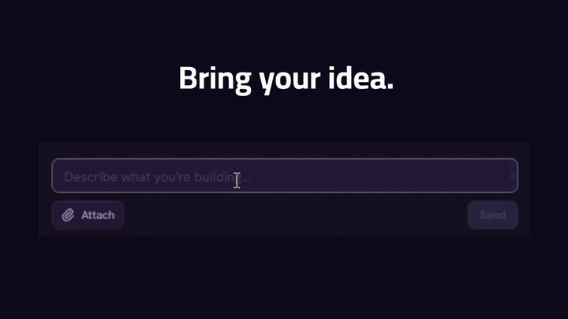
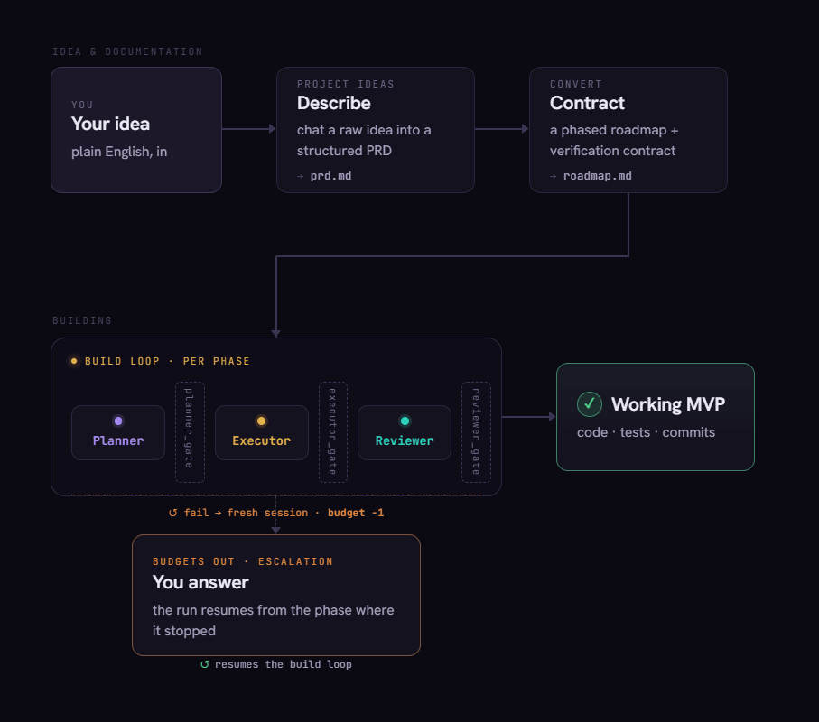
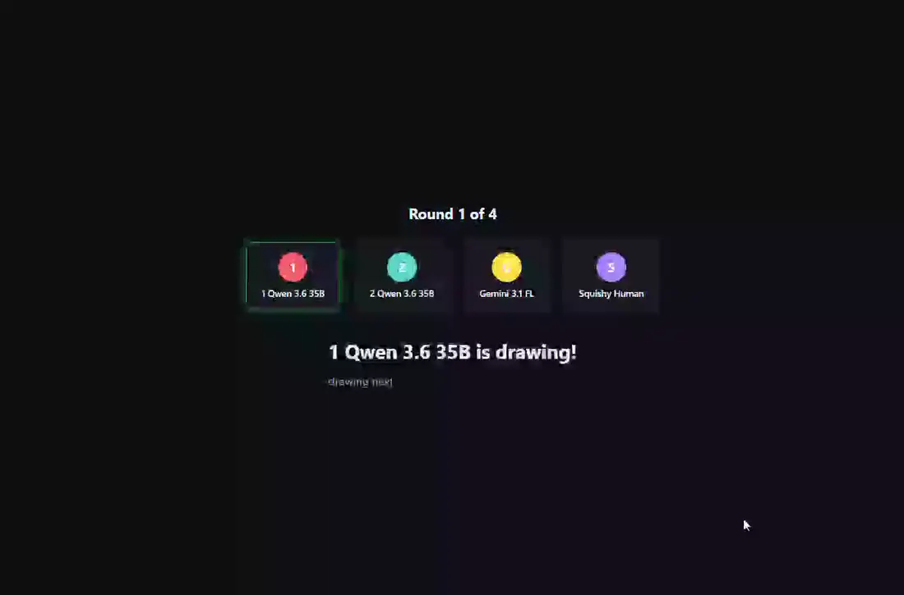
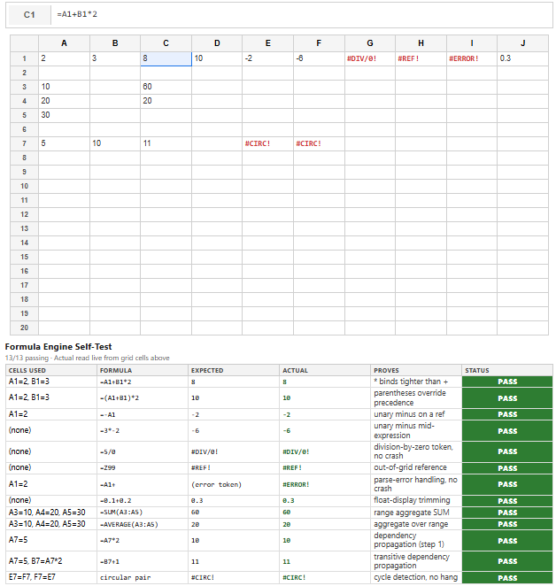
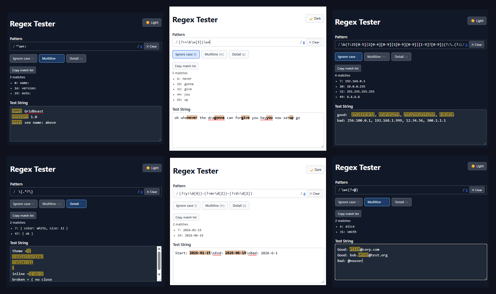
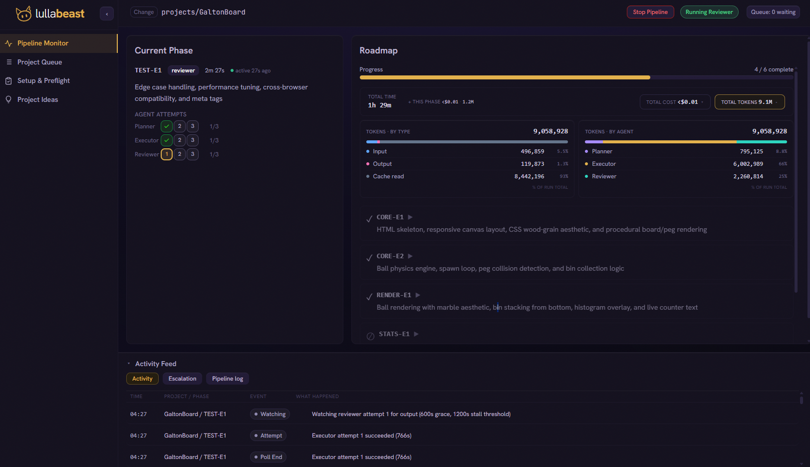

<p align="center">
  
</p>

<div align="center">

[](https://lullabeast.ai)
[](LICENSE)
[](https://github.com/bigbraingoldfish/lullabeast/actions/workflows/ci.yml)
[](https://docs.openclaw.ai)


</div>

Lullabeast is an open-source, local-capable, autonomous development pipeline. Describe what you want to build in plain English, and your team of agents (planner, executor, reviewer) implements it phase by phase against a real git repository, with deterministic gate scripts checking every step and an escalation path back to you when they get stuck.

Lullabeast runs on [OpenClaw](https://docs.openclaw.ai/) and requires it: Lullabeast is the pipeline and dashboard, while the agents themselves run inside OpenClaw's runtime environment, which you install and run separately.

<p align="center">
  
</p>

> **Early release, and honest about it.** Lullabeast reliably builds small, single-purpose webapps end to end, and hard phases escalate to you by design, but larger or more complex projects tend to surface more issues and need more polish before they're done. This beta release is a single-user tool meant to run on a trusted machine, protected by a locally generated access token. (I personally run the pipeline and OpenClaw in a VM for transparency.) I'm shipping now to get it in front of other builders and find out where it breaks so I can strengthen it. Bug reports and suggestions are welcome.

---

## Why it exists

Open-weight models like Qwen, Kimi, and MiniMax cost a fraction of frontier prices, and they fail in known, repeatable ways. Lullabeast is built around those failures:

| The failure mode | How Lullabeast handles it |
|---|---|
| **Deleting files** under context pressure | Every deletion has to be declared up front. If a file disappears that wasn't, the gate flags it and the phase re-runs. |
| **Drifting from the spec** as a build grows | Context is cleared between tasks and each one stays atomic, so focus stays narrow against a clear definition of done; the reviewer then confirms those principles held across the whole phase. |
| **Declaring victory** without running the tests | A phase can't close until the gate confirms every required test exists, is structured correctly, and passes. |
| **Disappearing mid-turn** and leaving you guessing | Each agent gets three real attempts before anything is flagged to you, and timeouts catch an agent that never starts or hangs, so one dropped turn never sinks the run. |

---

## How it works

<p align="center">
  
</p>

Queue several projects and Lullabeast works them in order, honoring dependencies between them.

**The agents.** Four pipeline agents and two ideation agents, run by a single orchestrator state machine that owns the git operations and recovery logic:

- **Planner:** turns the current roadmap phase into a concrete implementation plan.
- **Executor:** writes the code and tests, then commits to a phase branch.
- **Reviewer:** verifies the result actually behaves as intended, including screenshot-based visual review for UI phases.
- **Gate scripts:** deterministic, LLM-free Python checkers between every handoff: file manifest, git diff, test results, behavioral evidence, unaccounted deletions. The gates are the pipeline's source of truth; no agent advances on its own say-so.
- **Escalation:** invoked only when gates and retries are exhausted; notifies you and pauses.
- **prd-creator / roadmap-converter:** drive the idea, PRD, roadmap front end.

---

## Examples

Lullabeast works best for small, focused webapps. Each one below was built end to end by the pipeline.

### Flagship: SVG Pictionary

<p align="center">
  
</p>

Multiple AI players and a human in a round-based draw-and-guess game over real SVG: multi-screen routing, persistent per-round state, and live, simultaneous LLM API calls that render elements both the models and the player act on. The hardest target on this list, an application rather than a widget.

| GridBeast | 2048 | Regex Tester |
| :---: | :---: | :---: |
|  |  |  |

| Conway (classic) | Conway (conquest) |
| :---: | :---: |
|  |  |

Every example links the exact PRD and phased roadmap that drove its build:

| Project | PRD | Roadmap | What it is |
|---|---|---|---|
| SVG Pictionary | [PRD](examples/svgbeast/PRD.md) | [Roadmap](examples/svgbeast/roadmap.md) | Flagship: multi-screen, persistent state, live simultaneous LLM API calls |
| GridBeast | [PRD](examples/gridbeast/PRD.md) | [Roadmap](examples/gridbeast/roadmap.md) | Mini spreadsheet; formula engine with precedence, ranges, cycle detection |
| Regex Tester | [PRD](examples/regex/PRD.md) | [Roadmap](examples/regex/roadmap.md) | Live matcher; inline flags, in-place highlighting, light/dark |
| 2048 | [PRD](examples/2048-api/PRD.md) | [Roadmap](examples/2048-api/roadmap.md) | Tile-merge game; correct merge semantics, score/best, spawn-on-move |
| MultiLife (Conway) | [PRD](examples/game-of-life/PRD.md) | [Roadmap](examples/game-of-life/roadmap.md) | Two rule systems (classic + conquest) over one grid engine |

*GridBeast's functionality was manually verified, before I generated the self-test panel using the same foumulas in a follow-up pass to surface correctness at a glance.*

**Built with.** No closed frontier models anywhere in the loop, just local and open-weight cloud:

| Project | Planner | Executor | Reviewer |
|---|---|---|---|
| MultiLife (Conway) | `llamacpp/Qwen3.6-27B-MTP` | `llamacpp/Qwen3.6-27B-MTP` | `llamacpp/Qwen3.6-27B` |
| Regex Tester | `llamacpp/Qwen3.6-27B-MTP` | `llamacpp/Qwen3.6-27B-MTP` | `llamacpp/Qwen3.6-27B` |
| GridBeast | `llamacpp/Qwen3.6-27B` | `llamacpp/Qwen3.6-27B` | `llamacpp/Qwen3.6-27B` |
| 2048 | `openrouter/z-ai/glm-5.2` | `openrouter/moonshotai/kimi-k2.7-code` | `openrouter/moonshotai/kimi-k2.7-code` |
| SVG Pictionary | `openrouter/z-ai/glm-5.2` | `openrouter/moonshotai/kimi-k2.7-code` | `openrouter/moonshotai/kimi-k2.7-code` |

**Play it live.** *MultiLife (Conway)* was built twice: once locally with Qwen & again on cloud open-weight models. Both finished builds are **[embedded and playable side by side](https://lullabeast.ai/living-proof)** in your browser.

---

## Run it your way

Lullabeast is model-agnostic. OpenClaw owns all model configuration, so you choose the cost/quality trade-off:

| Mode | What runs the agents | Trade-off |
|---|---|---|
| **Budget cloud** (best results so far) | Open-weight multi-modal models via your OpenRouter key (e.g. MiniMax, GLM, Kimi, Qwen) | Cheap per token; your key, your provider |
| **Fully local** | Validated on a single RTX 4090 (48GB, modded) with `unsloth/Qwen3.6-27B-MTP-GGUF` & `llamacpp/Qwen3.6-27B` (both q8_0) | No cloud in the loop; front-end (UI) phases are the weak spot, with the most failures and retries |
| **Hybrid** | Local for **escalation + executor** (where most of the work, and the cost savings, happen), cloud for **planner and/or reviewer** (cheap to build a strong foundation and review thoroughly) | Often the best cost/quality balance; still being tuned |

**Model notes.** A **multi-modal** model is **required** for the **executor** and **reviewer** (the reviewer does screenshot-based visual review for UI phases) and **recommended** for the **planner**. Use the strongest model you're comfortable running for the **roadmap-converter**: it's isolated by design, so your most expensive model is spent only on conversion. I also suggest keeping the **idea-to-PRD chat (`prd-creator`) on a cloud model**, where it produces noticeably better drafts.

**Want the real numbers?** See the **[side-by-side runtime, tokens, and cost](https://lullabeast.ai/#a-build)** for the MultiLife builds.

---

## Quick start

### Requirements

Read this before running anything. The first item is a separate install:

- **A running [OpenClaw](https://docs.openclaw.ai) gateway.** Install it first ([install guide](https://docs.openclaw.ai/start/getting-started)) and have it listening on its default port, `localhost:18789`. Requires OpenClaw v2026.5.18 or newer.
- **Linux, macOS, or WSL2.** Native Windows is unsupported (the pipeline uses POSIX `fcntl` locking).
- **Python 3.11+** and `git` with a configured identity (`user.name` / `user.email`). The pipeline commits to your repos, and `install.sh` checks this.
- **Node.js 22+** with `npm`. Builds the signals plugin and the Playwright visual-review MCP, which is required for UI phases (`install.sh` adds it by default; `--skip-playwright` to opt out).

Running on non-default ports, or hitting setup snags? [SETUP.md](SETUP.md) covers configuration, version notes, and silent-failure modes in full.

### Install & run

```bash
# 1. Install and start OpenClaw first.
#    https://docs.openclaw.ai/start/getting-started
curl -s http://localhost:18789/v1/models   # should respond; "connection refused" = gateway not up

# 2. Install Lullabeast.
git clone https://github.com/bigbraingoldfish/lullabeast.git autodev-ui
cd autodev-ui
./install.sh            # interactive; registers agents with OpenClaw, generates your dashboard access token; safe to re-run

# 3. Run the dashboard from the repo root; the -m module form is required.
source .env
python -m ui.server
```

> **Launch command:** run `python -m ui.server` from the repo root (it binds `127.0.0.1` on the configured port, default `18790`). The script form `python ui/server.py` fails with `ModuleNotFoundError: No module named 'ui'`; use the module form above, or the equivalent `uvicorn ui.server:app --host 127.0.0.1 --port 18790` for CLI control of host/port.

The server prints your access URL at startup; open it (**`http://127.0.0.1:18790/?token=<AUTODEV_UI_TOKEN>`**). That authorizes your browser via a cookie (30 days); scripts can send the same token as a `Bearer` header instead. Then verify the webhook wiring once (use POST; a GET check can miss token mismatches):

```bash
curl -sS -o /dev/null -w "HTTP %{http_code}\n" -X POST http://127.0.0.1:18789/hooks/agent \
  -H "Authorization: Bearer <hooks.token>" -H "Content-Type: application/json" \
  -d '{"agentId":"prd-creator","sessionKey":"ideas:install-check:0","wakeMode":"now","message":"ping"}'
```

`HTTP 200` means you're wired up; `401` means the Bearer token doesn't match `hooks.token` in `openclaw.json`. The full walkthrough, including macOS LaunchAgent and Linux/WSL2 systemd units, is in **[SETUP.md](SETUP.md)**.

---

## The dashboard

<p align="center">
  
  <br><em>The Pipeline Monitor mid-run: live planner, executor, reviewer loop, per-phase metrics, activity feed.</em>
</p>

**Look before you install.** **[Tour the dashboard](https://lullabeast.ai/walkthrough)**. It's a snapshot preview of the interface from the MultiLife (Conway) build.

- **Project Ideas:** chat an idea into a PRD, then generate the roadmap + verification contract.
- **Setup & Preflight:** point at a project repo, run preflight checks, launch the pipeline.
- **Pipeline Monitor:** watch the live planner, executor, reviewer loop, per-phase metrics, and a real-time activity feed; recover from git errors or answer escalations.
- **Queue:** line up multiple projects with dependency ordering; Lullabeast runs them sequentially.
- **Cost & token visibility:** per-phase and per-agent cost/token breakdowns, live during a run and recallable after, in both the Monitor and the Queue (shown when your models report usage).

---

## Security

- **The dashboard and `/api/*` require an access token** (`AUTODEV_UI_TOKEN`, generated by `install.sh`). Open the tokenized URL printed at startup to authorize your browser; scripts send the token as a `Bearer` header. This is single-user, local-tool auth: one shared token, no accounts, roles, or audit trail.
- **Stay on loopback anyway.** Bind to **`127.0.0.1`** (the default); the server refuses non-loopback requests unless a token is configured. Never expose the raw port to the internet; anything beyond a trusted LAN belongs behind a reverse proxy + TLS. See [SECURITY.md](SECURITY.md) and [SETUP.md: Security and network exposure](SETUP.md#security-and-network-exposure).
- The pipeline **executes agent-written code on the host** under your user account. Treat Lullabeast as operator tooling for a trusted machine, not a multi-tenant service.
- Secrets (the dashboard token `AUTODEV_UI_TOKEN` and the webhook Bearer token `AUTODEV_HOOKS_TOKEN`) live in `.env` (gitignored). Never commit them in `ui/config.json` or any tracked file.

---

## Troubleshooting

| Symptom | Likely cause | Fix |
|---|---|---|
| UI says `RUNNING` but no agents ever fire | OpenClaw gateway is down | `curl -s http://localhost:18789/v1/models`; connection refused means start the gateway |
| Webhook returns **401** | `hooks.token` ≠ `AUTODEV_HOOKS_TOKEN` | Sync the Bearer secret (install.sh step 8 does this) |
| Dashboard or `/api/*` returns **401** | browser not authorized / wrong `AUTODEV_UI_TOKEN` | Open the tokenized URL printed at server startup |
| `orchestrator.py not found` on launch | `.env` not sourced | `source .env` before starting uvicorn |
| Every **UI/INT** phase fails at the reviewer | Playwright MCP not installed | Re-run `./install.sh` without `--skip-playwright` |
| Header shows **Queue stalled** | all queued projects blocked / in dependency hold | Clear a parent or resume a banked escalation answer |

A deeper **"Silent failure modes"** walkthrough lives in [SETUP.md](SETUP.md#silent-failure-modes-four-cases).

---

## Project layout

```
autodev/
  pipeline/         # orchestrator, sentinel poller, gate scripts, skill manager
  skill-library/    # per-discipline, per-role SKILL.md injected per phase
  agents/           # agent identity docs deployed into OpenClaw workspaces
  plugin/           # autodev-pipeline-signals OpenClaw plugin (TS to esbuild bundle)
  config/           # skill mapping, MCP + session setup
  docs/             # PIPELINE-SPEC, PIPELINE-CONSTRAINTS, assumptions
ui/                 # FastAPI server + single-file React dashboard (no build step)
tests/              # UI server tests
install.sh          # interactive installer
```

Pipeline state (lock, queue, event log, ideas) lives in `<repo>/.autodev/`; OpenClaw's own config and agent workspaces live under `~/.openclaw`. `ui/server.py` (all API routes) and `autodev/pipeline/orchestrator.py` (the whole state machine) are intentionally single-file to keep control flow auditable; read [CLAUDE.md](CLAUDE.md) before refactoring either. The full spec is [autodev/docs/PIPELINE-SPEC.md](autodev/docs/PIPELINE-SPEC.md).

---

## Documentation

| Doc | What it covers |
|---|---|
| [SETUP.md](SETUP.md) | Full install, openclaw.json requirements, silent-failure modes, cost metrics |
| [GLOSSARY.md](GLOSSARY.md) | Dashboard terminology (pipeline/queue states, skills, metrics) |
| [CLAUDE.md](CLAUDE.md) | Complete contributor orientation and architecture deep-dive |
| [CONTRIBUTING.md](CONTRIBUTING.md) | Dev setup, PR conventions, adding skills |
| [SECURITY.md](SECURITY.md) | Security model and vulnerability reporting |
| [CODE_OF_CONDUCT.md](CODE_OF_CONDUCT.md) | Community expectations for participation (Contributor Covenant) |
| `autodev/docs/PIPELINE-SPEC.md` | The architecture spec / single source of truth |

---

## License

[MIT](LICENSE) © 2026 Lullabeast contributors.
