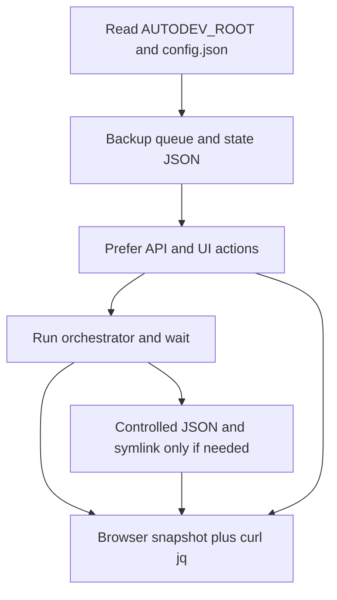

# Strict Queue E2E validation runbook (accountable second pass)

This document defines **how** to run the same validation scope as [04-UNIFIED-RUNNER-PROMPT.md](04-UNIFIED-RUNNER-PROMPT.md) without the failure mode of **pytest-as-primary**, **unforced scenarios**, or **"N/A (live)"** as a hiding place.

**Canonical use:** Humans and agents follow this file for enforceable queue manual E2E validation on the Pi.

---

## Part 0 — Global rules (entire engagement; non-negotiable)

These apply from the first command to the final report. Violating any item is a **failed validation run**, not a partial success.

| ID | Rule |
|----|------|
| **R1** | **Spec order:** [TASK-03-PROJECT-QUEUE.md](../TASK-03-PROJECT-QUEUE.md) (including **Implementation notes at EOF**) → [00-source-of-truth.md](00-source-of-truth.md) → live code [`autodev/pipeline/orchestrator.py`](../../../autodev/pipeline/orchestrator.py), [`ui/server.py`](../../../ui/server.py), [`ui/index.html`](../../../ui/index.html). Cite this order in the report **Summary**. |
| **R2** | **No product code edits** in the repo under validation (no "fixing" bugs during the run). **Runtime data and symlink targets are allowed** when used to **force** scenarios (see Part 1). File tickets for code gaps. |
| **R3** | **Primary evidence is UI + integrated behavior.** Browser: navigate, snapshot, click, **wait**, snapshot again. **pytest is optional secondary**; it may **supplement** but **never replaces** UI/API proof for a claimed **Pass**. |
| **R4** | **Wait discipline (mandatory):** After any action that can change async state (orchestrator, webhook, file write), use **at least one** of: (a) `browser_wait_for` (text or condition), (b) shell loop: `sleep` **2–10s** between probes (never a single fire-and-forget `curl`), (c) documented max wall-clock **per checkpoint** (e.g. "up to 15 min for phase completion"). **Slowness is never a reason to skip.** |
| **R5** | **Forbidden shortcuts:** (1) Marking **Pass** on a gate/scenario without **browser snapshot excerpt** or **screenshot** for user-visible behavior. (2) Marking **Pass** using **pytest alone**. (3) Using **N/A** to mean "did not try." (4) Using **Skipped** except per **R6**. |
| **R6** | **Skipped** is allowed **only** for: **unsafe** (e.g. would send real escalation to production comms), **impossible** (e.g. required hardware missing), or **explicitly blocked by operator** before the run. **Impatience, session length, or convenience are not allowed reasons.** Each **Skipped** row must state **which class (unsafe / impossible / operator)** and **one sentence** of fact. |
| **R7** | **"N/A" ban (strict):** The report **Gate** and **Scenario** tables may use **N/A** **only** when the gate is **structurally out of scope** for this product version (prove with TASK-03 quote). Otherwise use **Fail** (attempted, condition not met) or **Pass**. If a scenario cannot be reached after **documented forcing attempts** (Part 1), default is **Fail**, not N/A. |
| **R8** | **Test project paths:** Use only these queue entry paths (unless operator overrides in writing): `/home/pi/projects/queue-test1` … `queue-test5-esc` per [00-source-of-truth.md](00-source-of-truth.md). The queue file **must** be cleaned or staged to match this matrix **before** scenario execution (Phase A checklist). |
| **R9** | **Accountability fields:** Every **Pass** row includes: **(a)** one UI quote (snapshot text or screenshot filename), **(b)** one API snippet (`curl` JSON or `jq` path) **when an API contract exists**, **(c)** timestamp or step id. **Fail** rows include **what was tried** (commands, files touched, waits) and **what was observed**. |

---

## Part 1 — Control surfaces: "forcing" scenarios (symlink, files, API)

Validation must **actively drive** state. Do not wait for luck.

### 1.1 Path constants (read before touching anything)

| Artifact | Default location | Code reference |
|----------|------------------|----------------|
| **AUTODEV_ROOT** | `~/.openclaw` (env override) | [`orchestrator.py`](../../../autodev/pipeline/orchestrator.py): `AUTODEV_ROOT`, `QUEUE_FILE`, `STATE_FILE`, `SYMLINK_TARGET` |
| **pipeline_queue.json** | `$AUTODEV_ROOT/pipeline_queue.json` | [`ui/server.py`](../../../ui/server.py) `pipeline_queue_path` in `DEFAULTS` / `load_config()` |
| **pipeline_state.json** | `$AUTODEV_ROOT/pipeline_state.json` | Orchestrator + UI |
| **pipeline-project symlink** | `$AUTODEV_ROOT/pipeline-project` → target repo | Orchestrator `SYMLINK_TARGET`; UI setup/repair in [`ui/server.py`](../../../ui/server.py) (~4036+) |

**Rule:** Resolve **actual** paths from **`ui/config.json`** + env (`AUTODEV_ROOT`, `AUTODEV_REPO_PATH`) the UI uses—do not assume defaults if the Pi overrides them.

### 1.2 API surface (prefer UI-equivalent calls)

Documented queue endpoints include: `POST /api/queue/add`, `DELETE /api/queue/{id}`, `PATCH /api/queue/mode`, `PATCH /api/queue/{id}/position`, `PATCH /api/queue/{id}/parent`, `POST /api/queue/trigger-next`, `POST /api/queue/{id}/relaunch`, `POST /api/queue/{id}/revalidate`, `GET /api/queue`, `GET /api/queue/status`, `GET /api/state`, `POST /api/command` (deferred). **There is no generic PATCH to set arbitrary row state to ESCALATION** in normal API—parked states come from **orchestrator** or **test-style fixtures**.

### 1.3 Forcing strategies (in order of preference)

1. **Orchestrator-driven (realistic):** Run pipeline until `WAITING_FOR_HUMAN`, roadmap **BLOCKED**, **QUEUE_HALTED**, etc., then **wait** (R4).
2. **Fixture-aligned file edit (backup first):** Mirror patterns in [`tests/test_queue_api.py`](../../../tests/test_queue_api.py) (temporary dirs, synthetic queue JSON, `ESCALATION` rows). For the **live Pi**, **copy `pipeline_queue.json` and `pipeline_state.json` to `.bak`**, then write **valid JSON** matching production schema so the UI shows **ESCALATION** / **BLOCKED** / mixed halt. **Restart or rely on server re-read** as applicable (note: UI may cache—verify with `GET /api/queue`).
3. **Symlink:** `ln -sfn <real-project-path> ~/.openclaw/pipeline-project` (or configured path) to align symlink target with **`pipeline_state.json` `project_path`** for **deferred command**, **ingest**, and **parked_pipeline_status** merge tests. Confirm with `readlink -f`.
4. **Never** claim a pass on **ingest** without either (a) live `project_path` absent from file queue + **ingest-** row in UI, or (b) **Fail** with **exact** `GET /api/queue` output after forcing.



---

## Part 2 — Wait patterns (copy-paste patterns; not optional)

**Shell (terminal `sleep`):**

```bash
# Example: poll until queue shows ESCALATION in jq (adjust jq path)
for i in $(seq 1 120); do
  curl -s http://localhost:18790/api/queue | jq '.queue[] | {name, state}'
  sleep 5
done
```

**Browser:** `browser_wait_for` with **text** that must appear on Queue or Monitor (e.g. `ESCALATION`, `QUEUE_HALTED`, `ingest-`). If not visible after **documented** max iterations, record **Fail** with last snapshot.

**Rule:** Every scenario step that depends on async state **must** reference either a **loop count × interval** or **browser_wait_for timeout** in the report.

---

## Part 3 — Phased execution (substantial checklists)

### Phase A — Preconditions and lock-in

**Requirements (all must be checked):**

- [ ] **A1** UI base URL recorded (e.g. `http://localhost:18790`).
- [ ] **A2** `curl -s -o /dev/null -w '%{http_code}' …/api/state` → **200**.
- [ ] **A3** `AUTODEV_ROOT` and `pipeline_queue_path` resolved from env + [`ui/config.json`](../../../ui/config.json).
- [ ] **A4** Backup: `cp pipeline_queue.json pipeline_queue.json.bak.$(date +%Y%m%d%H%M)` and same for `pipeline_state.json` (paths from A3).
- [ ] **A5** Queue contents **either** emptied per [02-prerequisite-setup.md](02-prerequisite-setup.md) **or** operator-approved minimal set **strictly using queue-test1–5** paths.
- [ ] **A6** All five test dirs exist and pass preflight (git + `roadmap*.md`).
- [ ] **A7** Read order completed: 00 → 01 → 03 → TASK-03+EOF (per R1).

**Exit criterion:** Written one-paragraph **Environment block** in the report listing paths, queue mode, and backup filenames.

---

### Phase B — Scenario execution (S1–S9) with gate mapping

For **each** of S1–S9 from [03-functional-validation-prompt.md](03-functional-validation-prompt.md):

**Per-scenario checklist (copy for S1, S2, … S9):**

- [ ] **B1** State **queue_mode** (auto/manual) **before** steps.
- [ ] **B2** **Browser first:** open Project Queue (and Monitor when needed); snapshot **before** action.
- [ ] **B3** Perform actions (UI and/or curl/API/symlink/file per Part 1).
- [ ] **B4** **Wait loop** (Part 2) until pass condition **or** documented timeout.
- [ ] **B5** Snapshot **after** state stabilizes.
- [ ] **B6** `curl` parity: `GET /api/queue`, and when relevant `GET /api/queue/status`, `GET /api/state`.
- [ ] **B7** Map to **G*** gates from [01-logic-gate-edge-cases.md](01-logic-gate-edge-cases.md); note gate ids in report row.
- [ ] **B8** Status: **Pass / Fail / Skipped (R6 only)** — never **N/A** for scenarios.

**Critical behaviors (must appear in at least one scenario’s evidence):** park-and-advance (`parked_*`, **ESCALATION**/**BLOCKED**), deferred **`POST /api/command`** + **`target_project_path`**, **ingest-** row, **QUEUE_HALTED** / **`queue_halted_reason`**, **`blocked_count`** includes parked rows in status/state APIs.

---

### Phase C — Gate matrix (G1–G14)

For **each** gate:

- [ ] **C1** Attempt to produce the gate’s condition using **Part 1** strategies (not "observe whatever exists").
- [ ] **C2** If orchestrator-only: run/wait per R4.
- [ ] **C3** Record **Pass / Fail / N/A** only if **R7** allows N/A; otherwise Pass/Fail.
- [ ] **C4** One evidence line meeting **R9**.

---

### Phase D — Secondary pytest (optional)

- [ ] **D1** Run `pytest tests/test_queue_api.py -q` and `pytest autodev/tests/test_orchestrator_queue.py -q` **separately** if combined collection fails (known quirk).
- [ ] **D2** Pytest results **appendix only** — do not use as primary Pass for any gate tied to UI.

---

### Phase E — Deliverable (single report; must include accountability)

Same sections as [04-UNIFIED-RUNNER-PROMPT.md](04-UNIFIED-RUNNER-PROMPT.md), plus:

- **Environment** (paths, backups, `queue_mode` timeline).
- **Wait budget** table: scenario × max wall time × interval used.
- **Forcing log:** symlink commands, file edits (with `.bak` reference), API payloads.

---

## Part 4 — Stop condition and operator sign-off

- **Done** when: every **S1–S9** has **Pass / Fail / Skipped(R6)**; every **G1–G14** has **Pass / Fail / N/A(R7)**; **Misalignments**, **Risks**, **Recommended tickets** filled; **R9** satisfied for every **Pass**.
- **Operator sign-off** (optional but recommended): name/date that backups exist and production escalation safety was considered for **Skipped** items.

---

## Related docs

| Doc | Role |
|-----|------|
| [04-UNIFIED-RUNNER-PROMPT.md](04-UNIFIED-RUNNER-PROMPT.md) | One-shot copy-paste prompt (same scope; less strict wording) |
| [00-source-of-truth.md](00-source-of-truth.md) | Stack, test paths, TASK-03 alignment |
| [03-functional-validation-prompt.md](03-functional-validation-prompt.md) | Scenarios S1–S9 |
| [01-logic-gate-edge-cases.md](01-logic-gate-edge-cases.md) | Gates G1–G14 |
