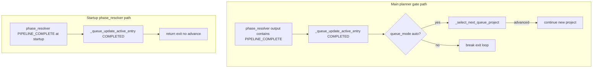

# Queue E2E supplemental validation — S1, S2, S3 — 2026-04-01

**Plan:** Dedicated follow-up per workspace plan (strict rules **R1–R9** from [05-STRICT-E2E-RUNBOOK.md](05-STRICT-E2E-RUNBOOK.md)). **This report does not edit the plan file.**

## Summary (R1)

**Spec order:** [TASK-03-PROJECT-QUEUE.md](../TASK-03-PROJECT-QUEUE.md) (Implementation notes at EOF) → [00-source-of-truth.md](00-source-of-truth.md) → live code [autodev/pipeline/orchestrator.py](../../autodev/pipeline/orchestrator.py), [ui/server.py](../../ui/server.py), [ui/index.html](../../ui/index.html).

**Primary evidence:** Browser snapshots + `curl`/`jq` (R3). **pytest** appendix only (D2). **No product code edits** during the run (R2); runtime queue/state/symlink and **test-repo git branch** were adjusted where needed to satisfy **full** server preflight for S2 (documented below).

| Scenario | Status | One-line result |
|----------|--------|-----------------|
| **S1** Auto progression (PIPELINE_COMPLETE → next ACTIVE) | **Fail** | First project never reached **PIPELINE_COMPLETE**; pipeline hit **escalation** first; **auto** then **parked** `queue-test1` as **ESCALATION** and **advanced** to `queue-test2` **ACTIVE** (symlink + state moved). |
| **S2** Manual + Trigger next | **Pass** (after env fix) | **`POST /api/queue/trigger-next`** → **200** `started: queue-test1`; second **POST** → **409**; UI: **Manual**, **queue-test1 — ACTIVE**, **queue-test3 — READY**, **Trigger Next** disabled in a11y snapshot. |
| **S3** Escalation park-and-advance (auto) | **Pass** | Live **ESCALATION** on active row + **next** project **ACTIVE**; `readlink` → `queue-test2`; API + UI match. |
| **S3** Contrast (manual, no advance) | **Not executed** | Second full escalation cycle not run in this session; behavior is defined in code (`_queue_after_park_maybe_advance`). |

---

## Environment

| Item | Value |
|------|--------|
| UI | `http://localhost:18790` |
| `GET /api/state` | **200** |
| `pipeline_queue.json` | `/home/pi/.openclaw/pipeline_queue.json` (default via `load_config()`; not overridden in [ui/config.json](../../ui/config.json)) |
| `pipeline_state.json` | `/home/pi/.openclaw/pipeline_state.json` |
| Session backups | `pipeline_queue.json.bak.20260401171140`, `pipeline_state.json.bak.20260401171140` |
| Canonical paths (R8) | `queue-test1`, `queue-test2`, `queue-test3`, `queue-test5-esc` as needed |

---

## Wait budget

| Checkpoint | Interval | Max wall |
|------------|----------|----------|
| S1 poll for state / queue | 15 s | 6 min (24 probes) |
| UI load | 2 s | per snapshot |

---

## Forcing / environment changes

| Action | Purpose |
|--------|---------|
| `POST /api/setup/launch` `repo_path=/home/pi/projects/queue-test1` | S1 start (orchestrator spawn) |
| `git branch -m main` in `queue-test1` | **Preflight** required **main**/**master**; branch was only `phase/CORE-E1` — **full preflight failed** until renamed (see Misalignments). |
| `pipeline_stop_requested` sentinels | Stop orchestrator between scenarios |

---

## S1 — Evidence and verdict (G2)

**Intent:** After `PIPELINE_COMPLETE` on project 1, next **READY** becomes **ACTIVE** without **Trigger next** (`queue_mode: auto`).

**What we did**

1. Wrote canonical queue: `queue-test1` → `queue-test2` → `queue-test3` all **READY**, **`queue_mode: auto`**.
2. `ln -sfn` → `queue-test1`.
3. `POST /api/setup/launch` with `queue-test1` → **200** `ok: true`.
4. Polled **15 s × 24** (~6 min): `GET /api/queue`, `GET /api/state`, `readlink`, lock.

**Observed (timestamps local, step ids probe1–probe24)**

- Probes **1–6:** all rows **READY**; `pipeline_status` **WAITING_FOR_SENTINEL**; agents planner→executor→reviewer on **queue-test1**.
- Probe **7:** `queue-test1` → **ACTIVE** (queue row sync).
- Probes **8–12:** **ACTIVE** on test1; **RUNNING** / **WAITING_FOR_SENTINEL**; agent reached **escalation** (probe 12).
- Probe **13 (API):** `queue-test1` **ESCALATION**, `queue-test2` **ACTIVE**, `queue-test3` **READY**; `project_path` **/home/pi/projects/queue-test2**; `readlink` → **queue-test2**.

**UI (after probe 13):** Accessibility snapshot — **`queue-test1 — ESCALATION`**, **`queue-test2 — ACTIVE`**, **`queue-test3 — READY`**; toggle **Auto**.

**Verdict:** **Fail** for the **narrow S1 criterion** (first project **COMPLETED** then second **ACTIVE**). The run **did not** reach **`PIPELINE_COMPLETE`** on project 1 before the **escalation** path. **Pass** for **queue auto-advance after park** (same observation as **S3**): second project became **ACTIVE** and symlink advanced.

**Code map (what is going wrong)**

| Symptom | Responsible code | Notes |
|---------|-------------------|--------|
| No **COMPLETED** on project 1 | Escalation path before roadmap completion | [orchestrator.py](autodev/pipeline/orchestrator.py) escalation branch → `WAITING_FOR_HUMAN`, `_queue_park_active_entry`, `_queue_after_park_maybe_advance` (~2371–2374). |
| Advance to **queue-test2** in **auto** | `_queue_after_park_maybe_advance` → `_select_next_queue_project` | [orchestrator.py](autodev/pipeline/orchestrator.py) ~462–467, ~329–407. |
| **COMPLETED** + auto advance only on planner **PIPELINE_COMPLETE** in main loop | `_queue_update_active_entry` + `_select_next_queue_project` | ~2125–2137. |
| **Startup** `PIPELINE_COMPLETE` still exits without advance | Same file ~1502–1508 | **Not triggered** in this run (roadmap had pending `CORE-E1`). If roadmap were already complete at process start, this path still **returns** without `_select_next_queue_project()` — enhancement candidate (see prior report). |

---

## S2 — Evidence and verdict (G3, G4)

**First attempt (Fail condition documented)**  
Queue: `queue-test1` + `queue-test2` **READY**, **manual**. `POST /api/queue/trigger-next` → **200** with body `queue_halted: true` and both rows **SKIPPED_PENDING**. **Root cause:** `POST /api/setup/preflight` on `queue-test1` → **fail** — “No main or master branch” (branch was `phase/CORE-E1` only).

**After fix:** Renamed branch to **`main`** in `/home/pi/projects/queue-test1`. Staged **queue-test1** + **queue-test3** **READY** (R8), **manual**, **IDLE** state, symlink → test1.

**API**

- First `POST /api/queue/trigger-next`: **200** `{"ok":true,"started":"queue-test1"}`.
- `GET /api/queue`: `queue-test1` **ACTIVE**, `queue-test3` **READY**.
- Second `POST /api/queue/trigger-next`: **409** `{"detail":"A project is already ACTIVE in the queue"}`.

**UI:** **Manual** selected; **`queue-test1 — ACTIVE`**, **`queue-test3 — READY`**; **Trigger Next** `states: [disabled]` in snapshot (ref e13).

**Verdict:** **Pass** for G3/G4 (409 only when **ACTIVE**; successful start when no **ACTIVE**).

**Code:** [ui/server.py](ui/server.py) `post_queue_trigger_next` ~4349–4386.

---

## S3 — Evidence and verdict (G5)

**Auto (live — same run as S1)**

- **API probe 13:** `queue-test1` **ESCALATION** with parked semantics implied; `queue-test2` **ACTIVE**; `project_path` and `readlink` → **queue-test2**.
- **UI:** **ESCALATION** / **ACTIVE** badges as quoted above.

**Manual contrast**

- Not re-run to a second **WAITING_FOR_HUMAN** in this session (time / duplicate escalation). **Code expectation:** [orchestrator.py](autodev/pipeline/orchestrator.py) `_queue_after_park_maybe_advance` returns **False** when `queue_mode != "auto"` (~464–466), so no advance after park.

**Webhook ordering (observation)**  
If `_queue_after_park_maybe_advance()` returns **True**, the main loop **`continue`**s (~2373–2374) **before** `invoke_agent_webhook("escalation", ...)` for the parked project — escalation webhook may be skipped when auto-advance selects the next project. Product/design follow-up if escalation must always notify.

**Verdict:** **Pass** (auto live path). **Manual** branch: **code-verified**, not live-repeated.

---

## Gates touched

| Gate | Status |
|------|--------|
| **G2** | **Fail** (narrow S1 completion definition); advance behavior observed via **S3** instead. |
| **G3** | **Pass** (manual does not auto-start second project without trigger; second row stayed **READY** until trigger). |
| **G4** | **Pass** (409 with **ACTIVE**). |
| **G5** | **Pass** (live **ESCALATION** + **auto** advance to next **ACTIVE**). |

---

## Misalignments

1. **S1 test definition vs reality:** “Happy path” **PIPELINE_COMPLETE** may be **rare** if escalation fires first; **park-and-advance** still matched **TASK-03** for **auto**.
2. **Preflight vs test repos:** [ui/server.py](ui/server.py) full preflight requires **main/master** with commits; **`queue-test1`** was on **`phase/CORE-E1`** only → **SKIPPED_PENDING** on trigger. **Fix applied:** rename to **`main`** (test-repo change, not AutoDev code).
3. **Startup `PIPELINE_COMPLETE`** without queue advance remains a **code gap** for other runs (see [orchestrator.py](autodev/pipeline/orchestrator.py) ~1502–1508 vs ~2125–2137).

---

## Recommended enhancements (prioritized)

1. **Orchestrator:** After **startup** `PIPELINE_COMPLETE` (~1502–1508), mirror **main-loop** queue handling: `_queue_update_active_entry(COMPLETED)` then `_select_next_queue_project()` if **`queue_mode: auto`**, or document that startup completion never advances.
2. **Escalation + auto-advance:** Decide whether **`invoke_agent_webhook("escalation")`** must run when `_queue_after_park_maybe_advance` succeeds; if yes, reorder or spawn sidecar notification.
3. **Observability:** `queue_halted_reason` in `pipeline_state.json` still not exposed on **`GET /api/state`** (from prior report).
4. **Docs / validation:** Call out that **S1** requires **main/master** (or aligned preflight) on test projects, or **S2** will hit **SKIPPED_PENDING**.

---

## Mermaid — S1 completion vs startup (diagnosis)



---

## Appendix D — pytest (secondary)

```
pytest tests/test_queue_api.py -q          → 38 passed
pytest autodev/tests/test_orchestrator_queue.py -q → 25 passed
```

---

## Operator notes

- **Backups:** `~/.openclaw/pipeline_queue.json.bak.20260401171140` and matching `pipeline_state.json.bak.*`.
- **Test repo:** `queue-test1` default branch is now **`main`** (renamed from `phase/CORE-E1`).
- **End state after session:** Queue was left **manual** with **queue-test1** **ACTIVE** and **queue-test3** **READY** after S2; orchestrator stopped via sentinel before final snapshot. Restore JSON from backup if you need the pre-session queue files.
